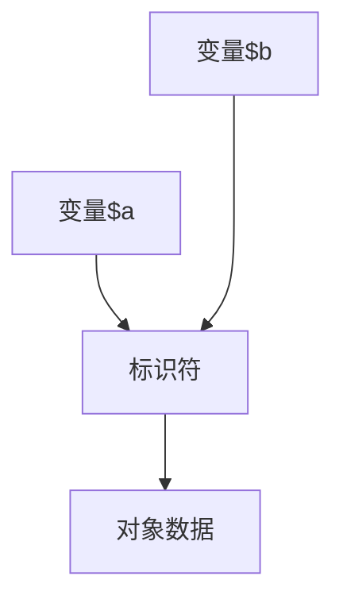

---
title: "PHP类的秘密(八) 对象的秘密"
date: 2021-09-05
---

# 对象的秘密
本文讲解了PHP类中, 关于各种对象的创建方法, 对象比较, 对象赋值的内在逻辑, 对象复制, 对象类型, 对象间的互相调用, instanceof类运算符, 其中还会介绍一些在使用中的小技巧. 使用好对象, 能让我们的程序更简洁. 

## 创建对象的N种方式

### new

$obj= new MyClass{};   //新建普通类MyClass{}的对象;

$obj1= new stdClass();  //新建内置类对象;

$ob2=new class{};     //新建匿名类对象;

以上三种new的创建方式, 可以用在类外, 也可以直接用在类内成员方法中, 这样的例子我们看过不少, 我这里举一个匿名类+链式调用的例子:

    class Outer
    {
        private $attr = 1;
        protected $attr2 = 2;

        protected function func1()
        {
            return 3;
        }

        public function func2()
        {   //新建匿名子类, 并将父类属性传给子类构造函数
            return new class($this->attr) extends Outer {   
                private $attr3;

                public function __construct($attr)
                {
                    $this->attr3 = $attr;
                }

                public function func3()
                {
                    return $this->attr2 + $this->attr3 + $this->func1();
                }
            };
        }
    }

    echo (new Outer)->func2()->func3();  //6
    
简单讲解一下这个例子的关键点:

1. 链式调用是由左至右执行; 创建父类对象, 并调用func2();

1. func2()方法建立新的匿名子类对象, 并初始化了\$attr3. 这时$this指代的不再是父类对象, 而是子类对象, 这一点很重要.

1. 通过子类对象调用, 可以正常调用父类func3(), 完成链式调用, 并执行方法体.

**new与代词搭配, 达到实例化指定类的目的,** 看下面这个例子:

    class ParentClass
    {
        function creatObjParent()
        {
            echo ' new self:';
            return new self;         //返回本类ParentClass的对象
        }
    }

    class Son extends ParentClass
    {
        function creatObjSon()
        {
            echo ' new parent:';
            return new parent;      //返回父类ParentClass的对象
        }
    }
    class Grandson extends Son
    {
        function creatObjGrandson()
        {
            echo ' new static:';
            return new static;      //返回调用者所在类的对象
        }
    }
    $aaa= new Grandson();
    echo get_class($aaa->creatObjGrandson());  //new static:Grandson
    echo get_class($aaa->creatObjSon());       //new parent:ParentClass
    echo get_class($aaa->creatObjParent());    //new self:ParentClass
    
### static静态方法创建对象

静态方法可以被类名和对象进行调用, 创建新的对象:

    class Store {
        static function creatobj()
        {
            return new static;
        }
    }

    $b=Store::creatobj();  
    var_dump($b);  //object(Store)#8 (0) { }

### **new的一些其他用法**

与对象搭配, 创建新的对象;

    class NewClass{};
    $a= new NewClass();
    $b= new $a;        //与对象搭配, 创建新的对象;
    var_dump($a==$b);  //true, 同一类的实例相等
    var_dump($a===$b); //false, 指代不同实例, 不全等
    
 通过字符串指代类名:
 
    class NewClass{};
    $a= 'NewClass';
    $b= new $a;
    var_dump($b);
    
**这里补充一下对象间的比较原则:**

当使用比较运算符（==）比较两个对象变量时，比较的原则是：如果两个对象的属性和属性值 都相等，而且两个对象是同一个类的实例，那么这两个对象变量相等。

而如果使用全等运算符（===），这两个对象变量一定要指向某个类的同一个实例（即同一个对象）。

### 4. 对象类型转换(object)

我们还可以将其他类型的数据, 比如字符串, 数字或数组转换成对象. 只需要在被转换对象前面加(object)即可.

**字符串转化为对象**:
    
    $a= 'NewClass';
    $ob=(object)$a;
    var_dump($ob);   //object(stdClass)#6 (1) {["scalar"]=>string(8) "NewClass"}

可以看到它创建了一个内置类stdClass, 并将字符串作为'scalar'的属性值; 这种处理方式同样应用于数字型, 大家可以在本地测试一下.

**数组转化为对象**:

    $a= [1,2,3,[1,2,3],'one'=>123,'two'=>321];
    $ob=(object)$a;
    print_r($ob);
    //output:
    stdClass Object
    (
        [0] => 1
        [1] => 2
        [2] => 3
        [3] => Array
        (
            [0] => 1
            [1] => 2
            [2] => 3
        )
        [one] => 123
        [two] => 321
    )
可以看到, 同样创建了一个内置类stdClass, 并将key作为了属性名, value作为了属性值, 如果是多维数组, 则第二维数组会作为一个属性的值. 你还可以通过指定key值来指定属性名. 可见将数组转化为对象, 是一个很快捷的创建对象的方式;

但是在转化数组型的时候注意一点: 属性名的命名规则, 由字母或者下划线开头，后面跟上任意数量的字母，数字，或者下划线。如果是不符合规则的属性名, 会导致无法访问属性.
    
   
    
## 2. 对象的赋值和引用

我们可以通过一个对象给另一个变量赋值, 或建立两个对象间的引用关系, 来创建另一个对象:

    class Myclass{};
    $a=new MyClass;
    $b=$a;
    $c=&$a;
    $d=new MyClass;
    
    echo (int)($b===$a);  //1, $b, $a两者全等, 指向相同对象
    echo (int)($c===$a);  //1, $c,$a两者全等, 指向相同对象
    print_r($c===$b);     //1, $c, $b全等;
    var_dump($d==$a);     //true, 两者都是同一个类的对象
    var_dump($d===$a);    //False, 两者指向不同对象
    
    $a->{'test'}=5;       //创建新属性并赋值
    print_r($b);          //Myclass Object ( [test] => 5 )
    Print_r($c);          //Myclass Object ( [test] => 5 )
    
    $a=5;
    var_dump($c);             //int(5)
    var_dump($b);             //object(Myclass)#11 (1) { ["test"]=> int(5) }

从上例可以看出关于引用和赋值的几点原理:

1. 无论是直接赋值, 还是引用, 等号两边指向的都是同一个实例. 当其中一个对象属性发生变化时, 另外两个对象同步变化

1. 同属于一个类的两个对象相等, 但不全等, 只有指向同一对象的两个变量才是全等的.

1. 当存在引用关系的其中一个变量$a发生变化时, 另一个变量$c也同步变化, 但不会影响到普通赋值的变量$b. 

**关于PHP中对象的存储方式**, 类似于指针:

一个对象变量不是保存整个对象的值, 而是保存一个标识符来访问真正的对象内容。 当对象作为参数传递/作为结果返回/或者赋值给另外一个变量，另外一个变量跟原来的不是引用的关系，**只是他们都保存着同一个标识符的拷贝**，这个标识符指向同一个对象的真正内容。

这就是为什么unset(\$a)不会影响到\$b, 但是修改\$a会影响到\$b的原因. 

**当我们将一个实例化对象赋值给一个变量时$a=new Myclass(), 实际上是建立了这个变量与标识符的对应关系.**

明白了这一点, 我们再看下面的例子:

    class ABB {
        public $foo = 1;
    }

    class BBB {
        public function foo(ABB $a)
        {
            $a->foo = 42;
        }

        public function bar(ABB $b)
        {
            $b = new ABB;
        }
    }

    $f = new ABB;
    $g = new BBB;
    echo $f->foo . "\n";

    $g->foo($f);
    echo $f->foo . "\n";

    $g->bar($f);
    echo $f->foo . "\n";

我当时的预期应该是1, 42, 1, 但是实际结果确实1, 42, 42. 脸被打得啪啪响. 这是为什么呢?

其实, 我们看function bar(ABB \$b)这个方法, 它实际上是新建了一个对ABB类的对象并赋值给\$f, **它给了\$f一个新的标识符, 但是并没有对\$f原来指向的对象数据进行修改**, 而且由于\$f和参数\$b没有引用关系, 所以这个变化不会影响到\$f, \$f->foo依然是42. 如果我们想让这个新标识生效, 则需要添加引用符号"&", 改为function bar(ABB &$b)即可;

那我们再看\$g->foo(\$f), 这个方法没有改变\$f与原本对象的关系, 并且通过\$f对对象的属性进行了修改, 那么所有指向这个对象的变量, 都会体现这个变化, 所以\$f->foo是42.

## clone对象复制

上面讲完了通过对象间的赋值运算和引用, 在PHP中, 我们还可以通过关键词clone来创建新对象, 那么clone和单纯的'='有什么区别呢?

    class NewClass{};

    $a=new NewClass();
    var_dump($a);      //object(NewClass)#6 (0) { }
    $b = clone $a;     //$b通过clone复制$a
    var_dump($b);      //object(NewClass)#8 (0) { }
    $c = $a;
    var_dump($c===$a); //True
    var_dump($b===$a); //False, 两者指向不同对象

通过上例, 可以直观看出, clone出的对象是一个新的实例, 是一个独立的个体, 指向另一组独立的对象数据. 后期即便改变$a, 也不会影响到$b, 除非他们内部有引用关系.

除此以外, clone还可以调用魔术方法__clone(), 与其他魔术方法不同的是, **__clone()方法不能被直接调用, 只能由clone关键词自动调用.** 同时不含任何参数.

当类中没有定义__clone()时, 则就会向上例中那样创建一个同类的新实例, 并将自己的属性和方法都复制过去. 

我们通过例子看一下__clone()的工作原理:

    class Clonetest
    {
        public $objs = 0;
        public $clones;

        public function __construct() {
            return ++$this->objs;
        }

        public function __clone() {
            return ++$this->clones;
        }
    }

    $obj = new Clonetest();
    $obj2 = clone $obj;
    print_r($obj);  //Clonetest Object( [objs] => 1  [clones] =>  )
    print_r($obj2); //Clonetest Object( [objs] => 1  [clones] => 1)
    
可以看到$obj2->clones变为了1, 系统自动执行了魔术方法.

如果原对象中存在引用关系, 则所有的引用属性仍然会是一个指向原来的变量的引用。

    class lkj
    {
        protected $var=6;
        public $ddd;
    }

    class ioi
    {
        protected $sss;
        public $asw;
    }

    $a=new lkj;
    $bb=new ioi();
    $a->ddd=&$bb;    //建立与对象$bb的引用关系
    $bb->asw=10;     //修改$bb的属性
    $ccc=clone $a;   //复制对象$a
    var_dump($ccc);  
    //output: object(lkj)#14 (2) {
      ["var":protected]=>
      int(6)
      ["ddd"]=>
      &object(ioi)#6 (2) {
        ["sss":protected]=>
        NULL
        ["asw"]=>
        int(10)
      }
    }

可以看到$c->ddd指向的对象属性同步发生了变化.

## 对象间的调用

同一个类的对象即使不是同一个实例也可以互相访问对方的私有与受保护成员。这是由于在这些对象的内部具体实现的细节都是已知的。

    class Foo5
    {
        private $bar;               //设置私有属性$bar

        public function debugBar(Foo5 $object)
        {
            echo $object->bar, "\n";
        }

        public function setBar($value)
        {
            $this->bar = $value;
        }

        public function setForeignBar(Foo5 $object, $value)
        {
            $object->bar = $value;
        }
    }

    $a = new Foo5();
    $b = new Foo5();
    $a->setBar(1);
    $b->setBar(2);
    $a->debugBar($b);        // 2   $a通过方法访问$b的私有属性
    $b->debugBar($a);        // 1
    $a->setForeignBar($b, 3);  //$a调用方法修改$b的私有属性
    $b->setForeignBar($a, 4);
    $a->debugBar($b);        // 3
    $b->debugBar($a);        // 4

## instanceof类运算符

instanceof 用于确定一个 PHP 变量是否属于某一类 class 的对象. 如果是则返回true. 它有几个使用规则:

如果一个对象是子类的对象, 那么它同时也属于父类. 但如果是父类的实例, 则不属于子类.

如果判断的对象不是对象类型, 则会返回false, 并不发出任何错误信息. 

类名可以是字符串或对象进行指代, 系统会自动将他们转化为类.

我们看一个例子:

    class Test
    {
        const CL=10;     //定义常量
    }

    class Child extends Test  {}  //定义子类

    $obj1=new Test();
    $obj2=new Child();
    var_dump($obj1 instanceof Test);      //true
    var_dump($obj1 instanceof Child);     //false
    var_dump($obj2 instanceof Test);      //true
    var_dump($obj2 instanceof Child);     //true
    var_dump(TEST::CL instanceof Test);   //false, 非对象类型
    var_dump($obj1 instanceof $obj2);     //false
    var_dump($obj2 instanceof $obj1);     //true
    $st='Child';
    var_dump($obj2 instanceof $st);       //true

----------------------------------------------------------

感谢阅读, 如有不准确和错误的地方, 请留言指正, 我会及时修正!

总结不易, 请勿私自转载, 否则别怪老大爷不客气!

欢迎热爱技术的小伙伴儿和我交流, 共同学习

参考资料:

www.php.net PHP官方文档
